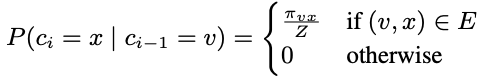
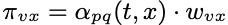
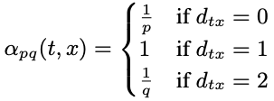

# Graph Embedding

|   Model   | Graph                                                                                                                                                                                                                                                                                                                                                                                                                                  | Embedding | Paper                                                                                                                   |
| :-------: | :------------------------------------------------------------------------------------------------------------------------------------------------------------------------------------------------------------------------------------------------------------------------------------------------------------------------------------------------------------------------------------------------------------------------------------- | :-------- | ----------------------------------------------------------------------------------------------------------------------- |
| DeepWalk | 无向无权图随机游走DFS                                                                                                                                                                                                                                                                                                                                                                                                                  | SkipGram  | [KDD 2014][DeepWalk: Online Learning of Social Representations](http://www.perozzi.net/publications/14_kdd_deepwalk.pdf)   |
|   LINE   | 有权图随机游走BFS                                                                                                                                                                                                                                                                                                                                                                                                                      |           | [WWW 2015][LINE: Large-scale Information Network Embedding](https://arxiv.org/pdf/1503.03578.pdf)                          |
| Node2Vec | 不同于DeepWalk的完全随机游走，采用带权随机游走：  其中，而  通过p和q两个超参数调节随机游走的倾向： - 若 p 较高，则访问刚刚访问过的顶点的概率会变低，反之变高。 - 若q>1，倾向于邻近的顶点（BFS）。若q<1，倾向于访问远离的顶点（DFS）。 |           | [KDD 2016][node2vec: Scalable Feature Learning for Networks](https://www.kdd.org/kdd2016/papers/files/rfp0218-groverA.pdf) |
|   SDNE   |                                                                                                                                                                                                                                                                                                                                                                                                                                        |           | [KDD 2016][Structural Deep Network Embedding](https://www.kdd.org/kdd2016/papers/files/rfp0191-wangAemb.pdf)               |
| Struc2Vec |                                                                                                                                                                                                                                                                                                                                                                                                                                        |           | [KDD 2017][struc2vec: Learning Node Representations from Structural Identity](https://arxiv.org/pdf/1704.03165.pdf)        |
