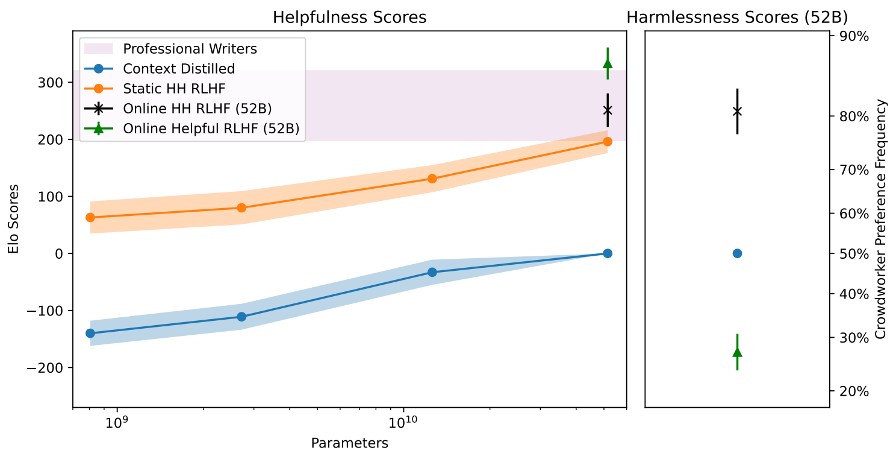

# Claude

paper：[2204.05862.pdf (arxiv.org)](https://arxiv.org/pdf/2204.05862.pdf)

## 1 导言

用RLHF训练一个有用且无害的助手（语言模型），有用性和无害性存在冲突，对齐这两个特性对于模型训练是一大挑战。

## 2 数据

让标注人员和模型进行对话，标注人员每问一个问题，模型会生成两个答案，答案可能来自相同或不同的模型，标注人员需要标注哪个回答更好。标注人员提问应尽量两个要求：

1. 提问让模型尽量能够回答
2. 诱导模型尽量说一些不该说的话

标注答案则跟着直觉走。审核标注数据质量时抽样一部分进行评估。标注人员分两类：按数据计费和按时间计费。前者可以生成更多的数据，后者可以生成更长的对话，数据质量更高。最终标注出来有两个数据集：有效性数据集和有害性数据集。

比较两个模型通过ELO分数：

## 3 模型

训练13M~52B多个模型，训练分为三步：

1. 基座预训练模型：在自然预料上进行无监督预训练
2. PMP（偏好模型预训练）：来自Slack、Reddit、Wikipedia的带用户评分的回答，构造对比训练数据进行预训练，学习率0.1，上下文窗口1024
3. RLHF：学习率0.01防止过拟合，上下文窗口在离线训练时先用1024，在线训练时用2048以适配长对话

对于PMP和RLHF过程，需要判断哪个回答更好，因此添加了"end-of-context"的token（类似BERT中的CLS），可以提升模型性能。整体流程如下图所示：

PM的鲁棒性：将数据分为train和test，使用train数据集训练的PM用来进行RLHF训练，用test数据集训练的PM模型评估RLFH的好坏，这样可以防止过拟合
