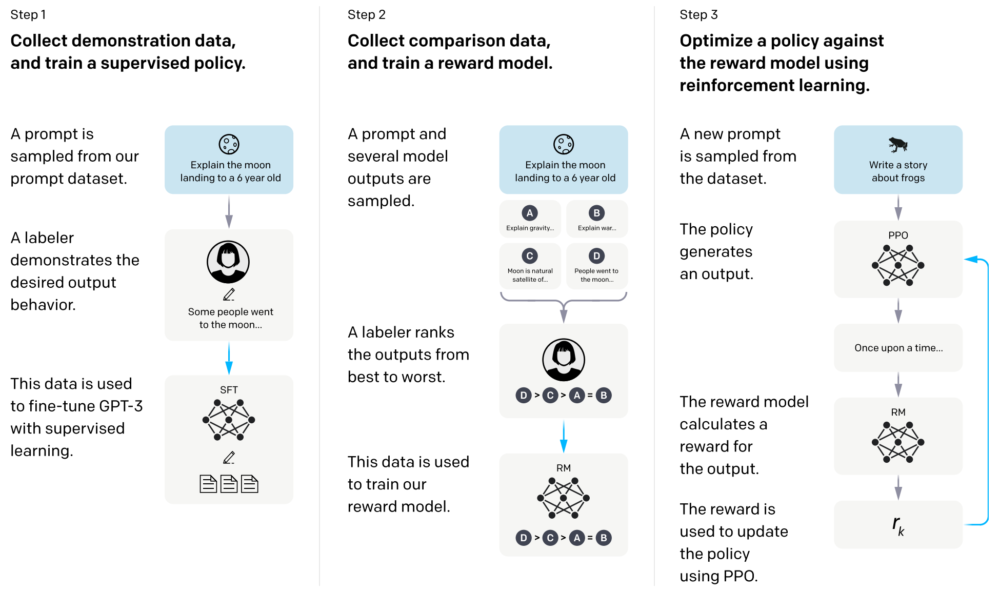
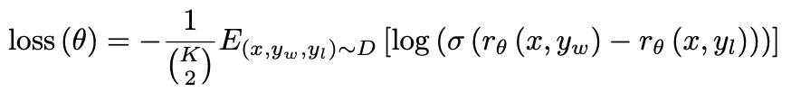
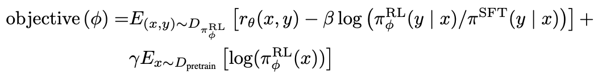
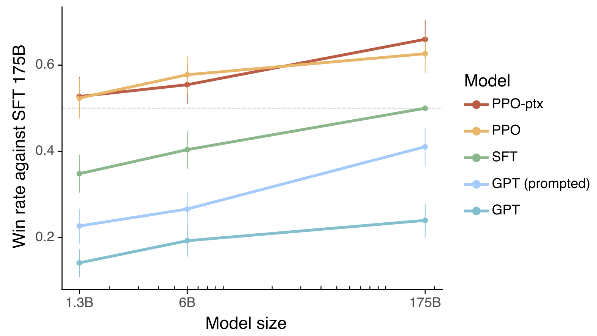

# InstructGPT

paper：[2203.02155.pdf (arxiv.org)](https://arxiv.org/pdf/2203.02155.pdf)

## 1 导言

GPT-3等无监督训练的大语言模型（Large Language Model）体现出了涌现能力，可以不通过微调直接在下游任务上实现零样本（Zero-Shot）学习与推理。由于其完全基于语言模型目标函数进行无监督训练，模型生成的内容具有很强的不确定性，训练的文本是几百亿这个数量级，你不知道里面会有什么东西，只能全送进去期待大力出奇迹，在模型投入生产的时候可能会存在以下两个问题：

1. 有效性：想让模型去学做一件事，但是模型就是学不会，因为你的文本中可能就没有相关的东西，或者模型可能生成的一些没有营养的甚至是虚假的内容，难以满足用户的需求；
2. 安全性：模型可能输出一些不应该输出的内容。

解决问题的方法就是使模型与其服务的用户进行align（包装一下有监督学习，OpenAI打自己脸），就在GPT-3基础上引进了有监督的微调（Supervised FineTune，SFT）和基于人类反馈的强化学习（Reinforcement Learning from Human Feedback，RLHF）这些技术，构成了InstructGPT，使得模型尽可能生成有效且安全的内容。

## 2 模型

### 2.1 有监督的微调（Supervised FineTune，SFT）

让标注人员来写问题和答案，使用 `GPT-3`在 `13000`个样本上微调 `16`轮（`epoch`），使模型过拟合。在这个数据集中，标注工的工作是根据内容自己编写指示，并且要求编写的指示满足下面三点：

* `Plain`：让标注人员写一个任意的任务，同时确保任务有足够的多样性
* `Few-shot`：让标注人员写指令，以及对应于该指令的多个查询/响应对
* `User-based`：让标注者根据一些在OpenAI API的等待列表申请中提出的用例写prompt。

按照用户切分训练集和测试集。标注数据的时候依据有用性，审核数据质量的时候依据真实性和无害性。

### 2.2 奖励模型（Reward Model）

先让SFT模型生成一批候选文本，让标注人员根据生成数据的质量对这些生成内容进行排序。把SFT模型的最后一层softmax去掉，用线性层映射成一个值，在 `prompt`和 `response`上一起训练，输出标量reward。模型是 `6B`而非 `175B`，原因是大模型训练会不稳定。训练样本有 `33000`个样本，采取 `Pair-Wise Ranking Loss`：

训练时取 `K=9`，会产生36个排序对，相对于之前工作取 `K=4`只会产生6个排序对。对于标注人员来说标注9个不会比标注4个产生太多的时间，对于模型来说却会产生多5倍的样本。实际训练中 `6B`模型的前向只需要计算9次，节约的时间会更多。

### 2.3 基于人类反馈的强化学习（Reinforcement Learning from Human Feedback，RLHF）

PPO算法：就是在如下损失函数上进行梯度下降

在强化学习中，模型 `π`叫做Policy，这里使用SFT模型进行初始化，用模型 `π`对31000个prompt输出结果 `y`，用RM模型对 `y`进行打分，计算第一项 `r`。第二项是一个KL散度，希望RL模型和初始化的差距不要太远。第三项是语言模型的损失函数，希望不要忘记 `GPT-3`的知识，保证模型在通用NLP任务上的效果。

## 3 实验结论

使用和175B SFT模型PK的获胜率来进行评估，1.3B模型在进行了SFT训练后提升巨大，远远大于模型的提升，但还是无法超过175B prompt的GPT-3，使用了PPO之后胜出175B SFT模型。
